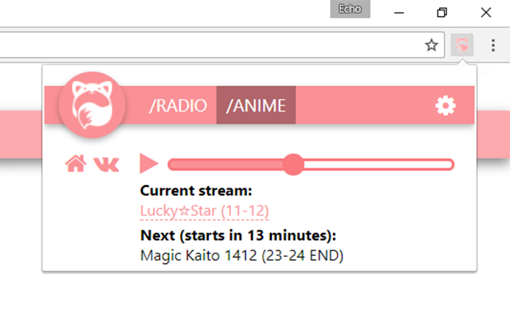

# Расширение Asian Wave для браузеров на Chromium

Текущая версия — 0.5.7.  
Скачать можно в [Chrome Web Store](https://chrome.google.com/webstore/detail/ecbegehkeefmdjnjhldeogkhbhhjhfje) и [Opera Addons](https://addons.opera.com/ru/extensions/details/asian-wave/).  

## To Do
* Переписать эту груду костылей с нуля;
* Добавить переводы на другие языки;
* Сделать порт под Firefox;
* Сделать возможность поиска текущего трека.

## Сборка
Необходимо установить git и Node.js (проверялось на версии 10.12.0), после чего выполнить следующие команды:
* `git clone https://github.com/tehcojam/aw_chrome`
* `cd aw_chrome`
* `npm i gulp-cli -g`
* `npm i`
* `gulp`
* `gulp scss:build`

Готовое к использованию расширение будет лежать в папке `build/`.

## Лицензирование
Весь код расширения доступен под [лицензией MIT](license.txt).

### Сторонний контент
* Логотипы проекта в `icons/` принадлежат [Asian Wave](https://asianwave.ru);
* Иконочный шрифт [Font Awesome](http://fontawesome.io) (только частично, спасибо [IcoMoon](https://icomoon.io/app)) – [SIL OFL 1.1](http://scripts.sil.org/OFL).
